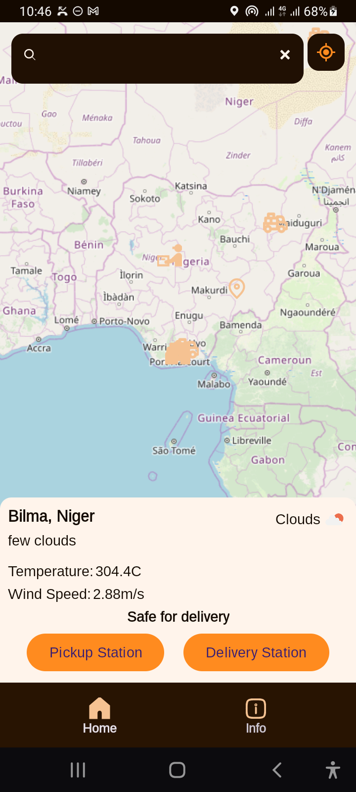
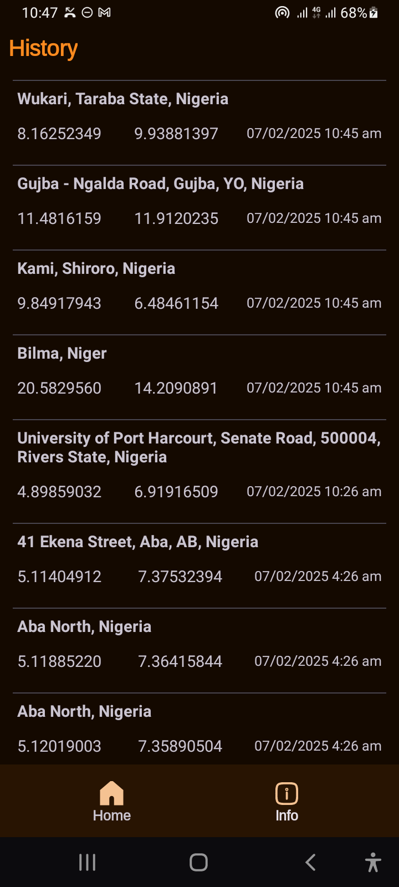
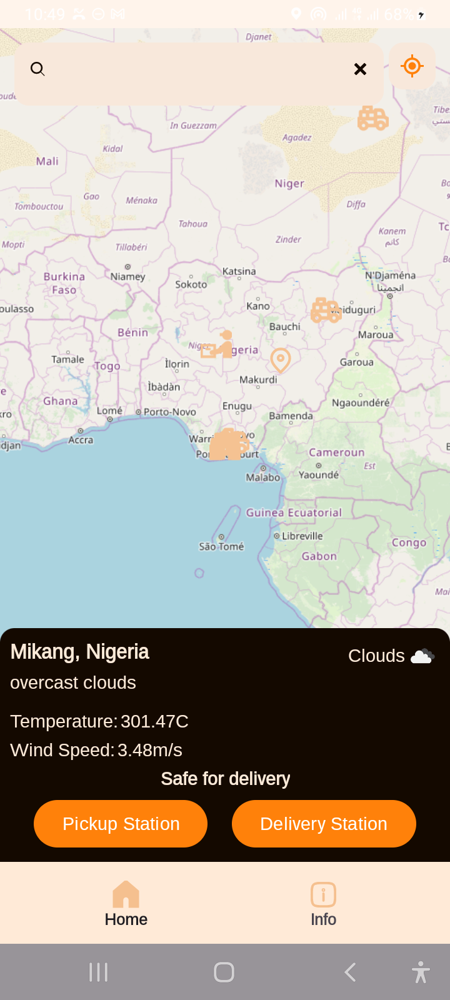
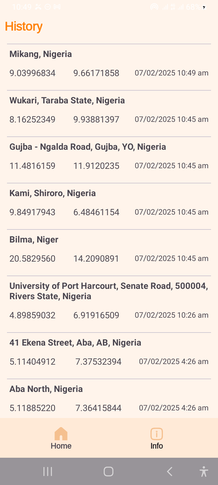

# DELIVERY WEATHER INSIGHT APP
The app utilises Location Services in Android, Maps and external apis to retrieve accurate weather conditions that are suitable for delivery 

## Features
 - **User Location Update** : Retrieves user's current location to notify user of location change
 - **Weather Information and Delivery Recommendations** : Weather location of a particular location can be retrieved and analysed to inform the user whether the current weather of the location is suitable for delivery
 - **Location and Station Markers** : Locations can be marked as pickup or delivery stations for easy navigation
 - **History** : History of location viewed by user are saved

## Screenshots

    
    
    
    

